
<h1 align="center">基于jspm商场停车服务管理信息系统</h1>

## 简介
基于jspm的商场停车管理系统：角色分为管理员和用户；功能包括用户管理、停车场管理、车位管理、车位预约、进场管理、结算离场管理及支付功能。    --计算机毕业设计源码；毕设源码；java毕业设计源码

## 联系方式

<h3 align="center">获取完整代码与数据库文件 + 微信：deepguan QQ: 86050149 QQ群: 783742310</h3>

<h3 align="center">可帮忙远程部署 包运行成功！提供远程部署、修改代码、设计文档指导、代码讲解等服务！</h3>

## 功能介绍（完整见运行截图）
管理员：管理停车场及停车位信息，包括添加、修改和删除停车场及车位。实现停车场类别选择、联系方式、车位状态设置、收费标准及相关信息的输入与维护。提供车位预约管理、结算离场管理功能，并支持批量操作及信息查询。用户管理模块支持用户的注册、信息查看与修改，支付页面提供多种支付方式选择，确保系统的高效运作。

用户：通过注册功能创建个人账户，填写姓名、电话和身份证信息。登录后访问个人中心，查看和修改个人信息。可进行停车位预约，通过输入车位相关信息或进行查询来选择合适的停车位。用户可以通过系统提供的多种支付方式完成支付操作，利用系统中的导航菜单访问不同的管理模块，提升停车服务的便捷性。

## 运行截图

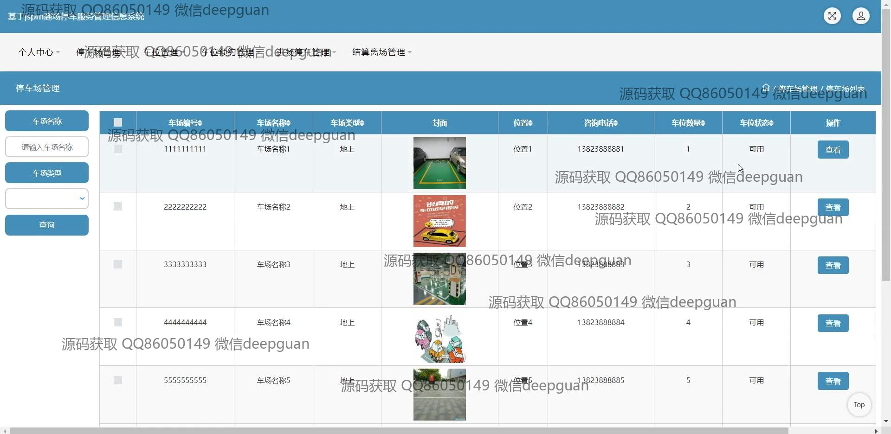
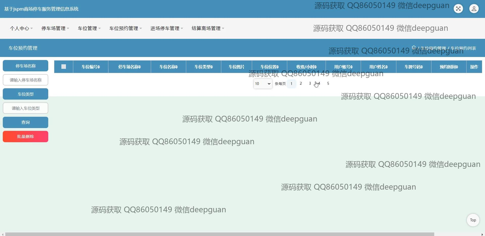

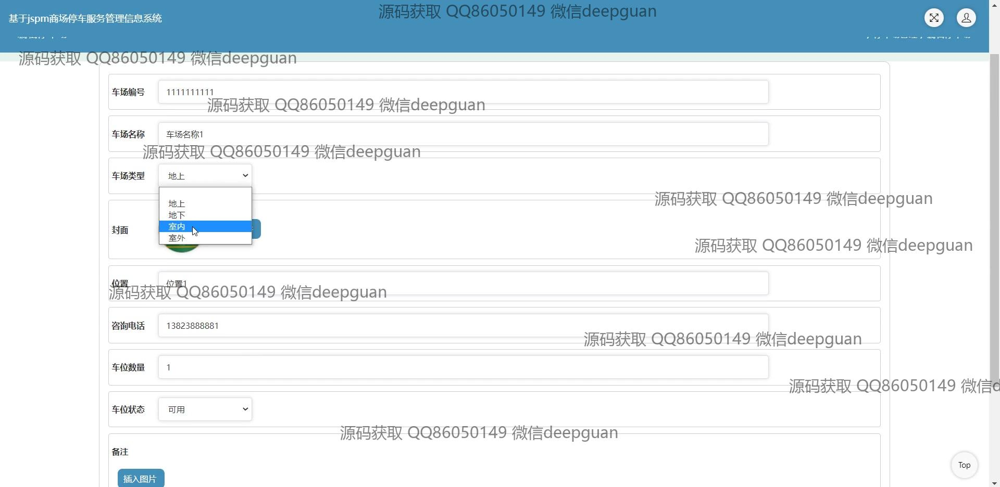
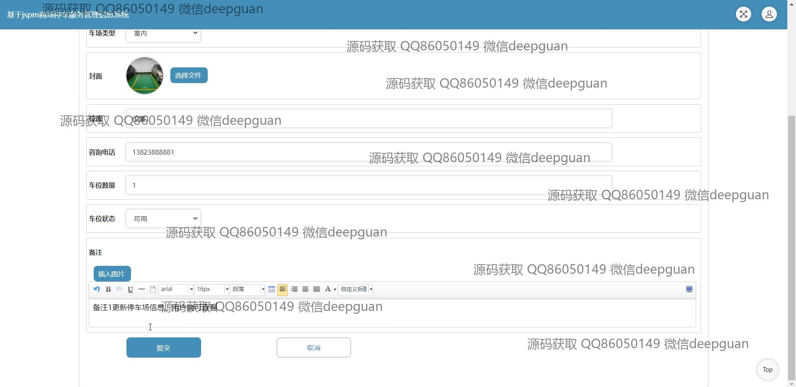
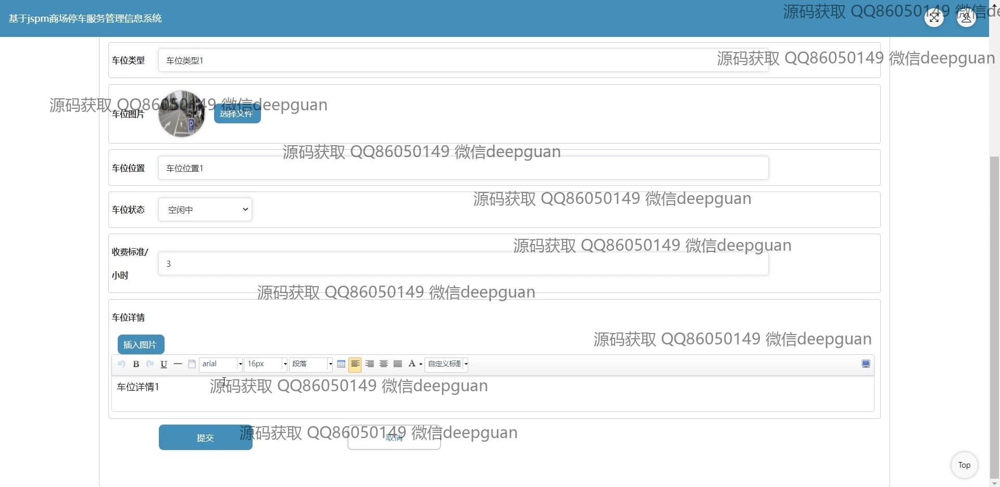
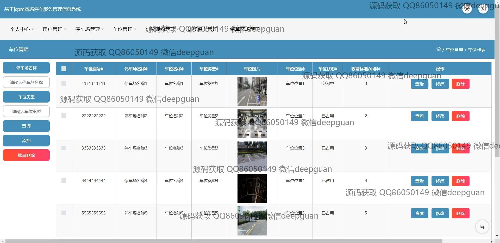
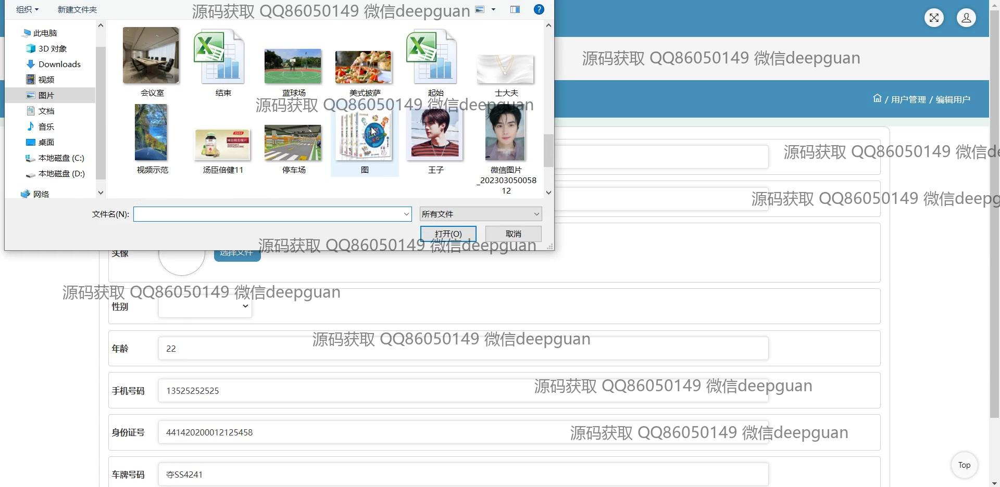
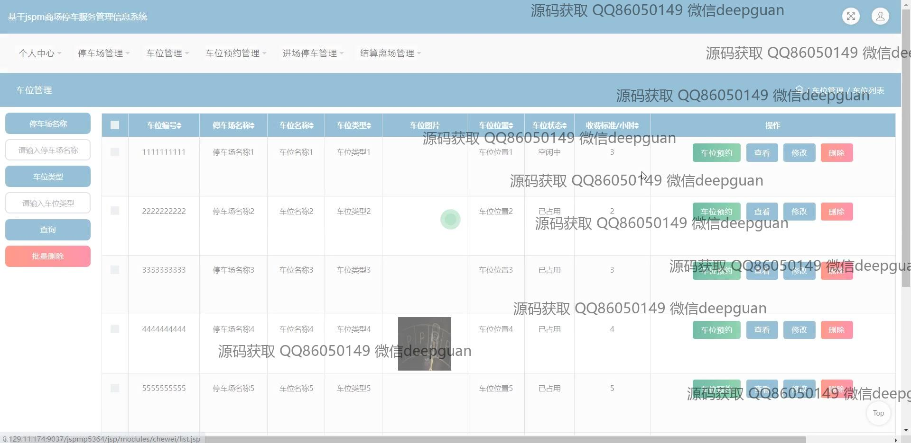
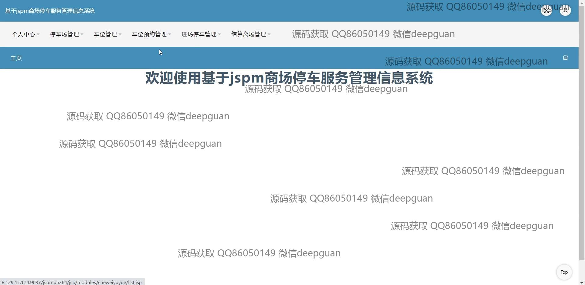
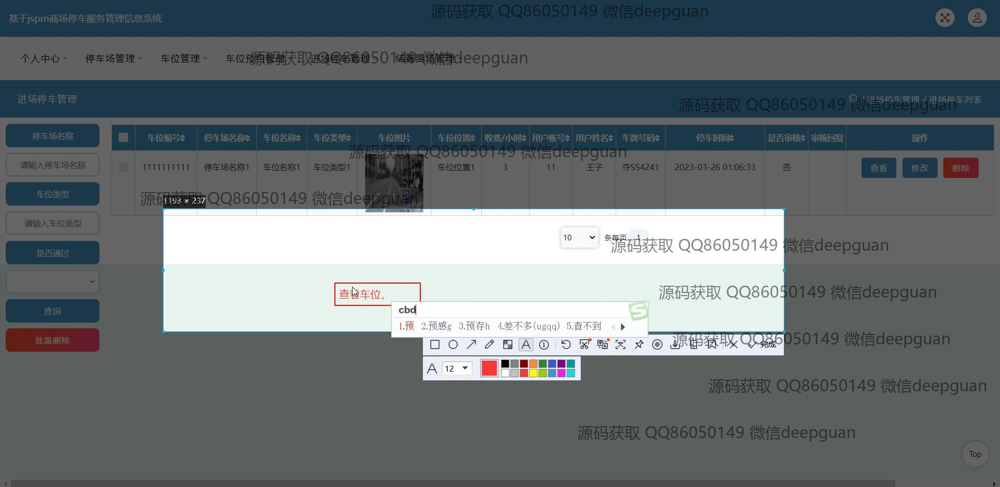
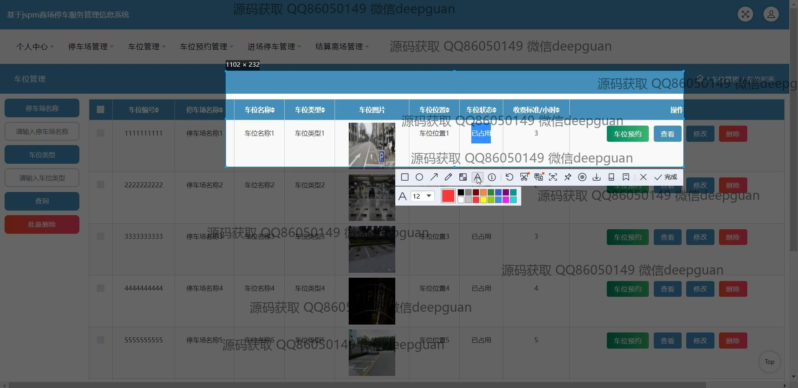
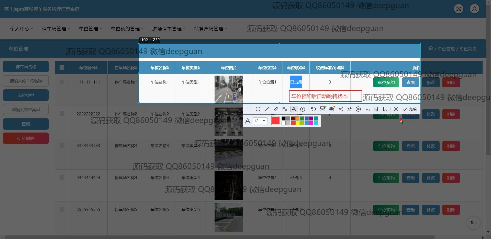
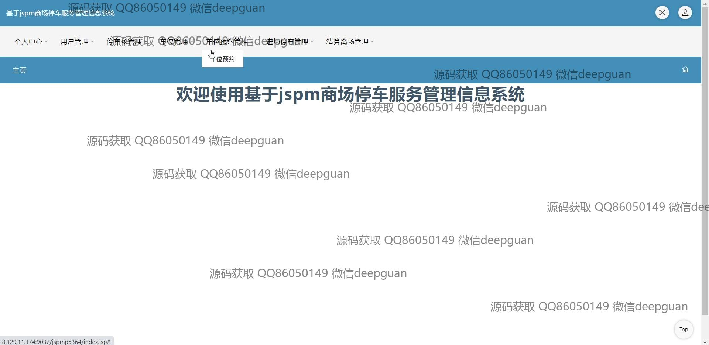
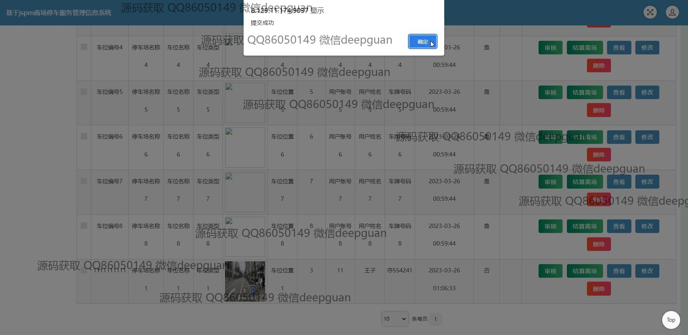
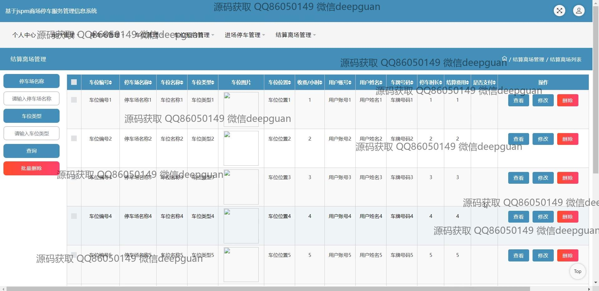
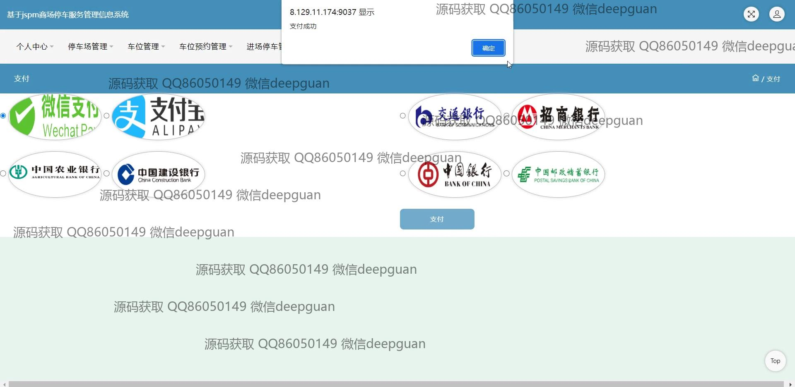
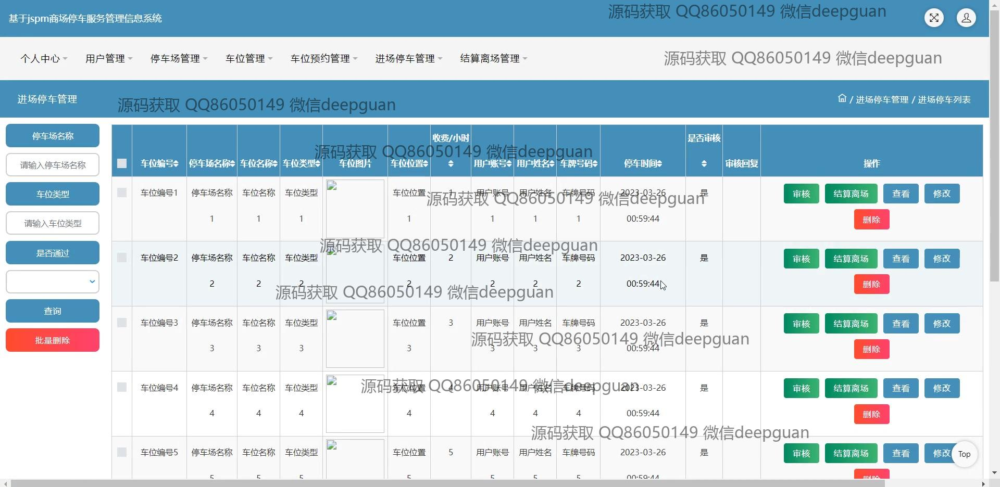
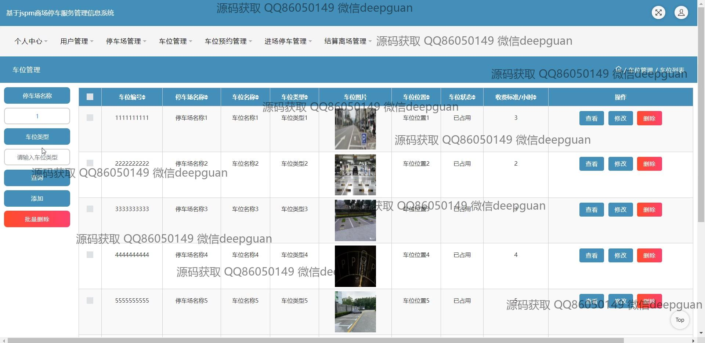
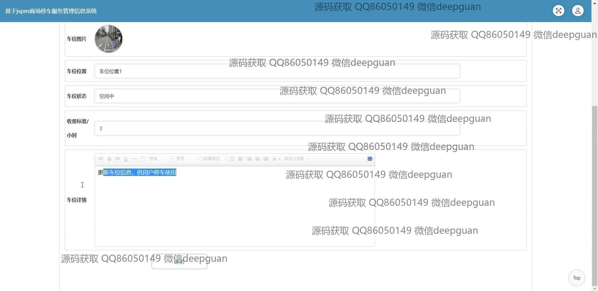

本代码来源于网络,仅供学习参考使用!

